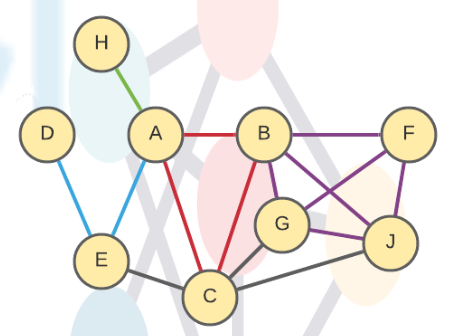

# Tarea Corta #1

## 1. Determine the degree, diameter and the bisection bandwidth of the network below:

Degree: 5 (Due to the upper bound B)

Diameter: 4 (From F to D)

Bisection Bandwidth: 3 * r, r being the bandwidth of a single node.

## 2. Draw a hybrid topology with a mesh backbone connecting two ring backbones. Each ring connects two star networks.

image::Hybrid_network.svg[]
