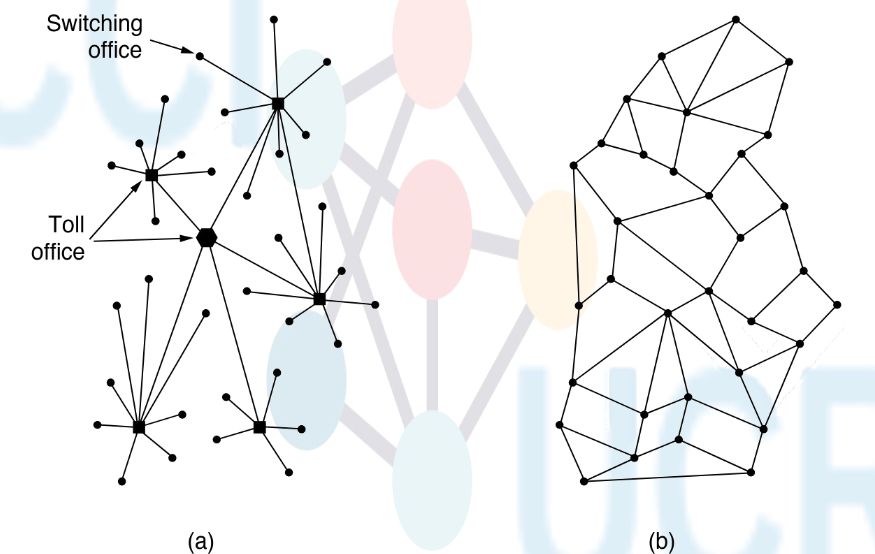

# Tarea Corta 4 (Realmente es la 3)

## Match the layers—Link, Network, and Transport—with the guarantees that each layer could provide to higher layers

| Garantía| Capa|
|-|-|
| Best effort delivery| Network|
| Reliable delivery| Transport|
| In-order delivery| Transport|
| Byte-stream abstraction| Transport|
| Point-to-point link abstraction| Data Link|

## Suppose that two network endpoints have a round-trip time of 100 milliseconds, and that the sender transmits five packets every round trip. What will be the sender’s transmission rate for this round-trip time, assuming 1500-byte packets? Give your answer in bytes per second.
$$
\text{Capacidad de transmisión del viaje redondo}=\frac{\text{Cantidad de bytes enviados}}{\text{Tiempo de transmisión}}
$$

Siendo las unidades bits/segundo, tenemos que convertir los paquetes totales enviados a bits y el tiempo de transmisión a segundos.
$$
\text{Capacidad de transmisión del viaje redondo}=\frac{1500\times5}{0.1}=\frac{7500}{0.1}=75000
$$

La capacidad de transmisión del receptor es de 75000 bits/s.

## The subnet of Fig. 1-12(b) was designed to withstand a nuclear war. How many bombs would it take to partition the nodes into two disconnected sets? Assume that any bomb wipes out a node and all of the links connected to it.

Se necesitarían 3 bombas para desconectar los conjuntos.
