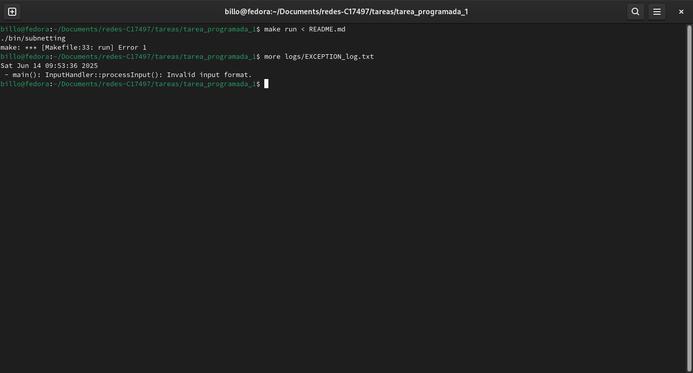

# Tarea Programada I: Subneteo

## Descripción

Este programa en C++ reparte un conjunto dado de direcciones IPv4 según una lista de solicitudes. La distribución de las direcciones se realiza de acuerdo con el orden especificado por el usuario, donde las direcciones pueden ser asignadas de menor a mayor o de mayor a menor, según la preferencia indicada. A continuación se detalla el funcionamiento, las especificaciones y cómo ejecutar el programa.

## Dependencias

- C++ 17 o superior.

- Librerías estándar de C++.

- g++ versión 8 o superior.

## Formato de la entrada
```
<dirección_IP> | <lista_de_subredes> | <orden>
```

- `dirección_IP`: La dirección original que se quiere subnetear. Sigue un formato de cuatro octetos divididos por puntos (e.g. 192.0.0.0).

- `lista_de_subredes`: Las solicitudes de subneteo a realizar. Se escribe el nombre y la cantidad de IPs utilizables necesarias de esta manera: `<nombre>, <cantidad>`, y se divide cada solicitud con `;`

- `orden`: Orden de asignación de las solicitudes. 'ASC' si se quiere que las subredes más grandes sean las IPs más bajas y `DESC` si se quiere que las subredes más pequeñas sean las IPs más bajas.

## Formato de la salida

Para la salida, se utilizó un sistema de logeo de varios niveles. Cada nivel tiene su propio archivo en la carpeta [/logs](./logs/):

- `DEBUG`: frases de debuggeo para saber qué está pasando.

- `INFO`: Información básica del flujo del programa.

-`EXCEPTION`: El manejo de errores del programa es por medio de excepciones, y cuando se atrapa una se logea en este archivo.

-`RESULTS`: Los resultados finales del subneteo.

Entonces, cuando se corre el programa, para observar los resultados del subneteo, basta con ir al archivo `RESULTS_log.txt` y observar los resultados.

Al ser logs, estos se mantienen después de la ejecución para facilidad de trazabilidad, sin embargo, se pueden eliminar los logs para mayor claridad luego de cada ejecución con el comando en el `Makefile`:

```
make delete_logs
```

## ¿Cómo correr el programa?

Se deben escribir todos los comandos siguientes dentro de una terminal en la carpeta [tarea_programada_1](.).


### Compilación

```bash
make
```

### Corrida

Hay dos formas de alimentar entrada al programa:

#### Por medio de archivos

Se utiliza la redirección de entrada:

```
make run < <archivo_a_ejecutar>
```

donde `archivo_a_ejecutar` es el archivo con la entrada con el formato dicho anteriormente.

Ejemplo:

```
make run < tests/input04.txt
```

#### Por medio de entrada estándar

También se puede correr por medio de la entrada estándar:

```
make run ARGS="192.0.0.0 | ECCI, 248; FM, 123; CE, 54 | DESC"
```

## Imágenes de prueba 

### Prueba de input01.txt


### Prueba de input02.txt


### Prueba de input03.txt


### Prueba de input04.txt


### Prueba de input con error

